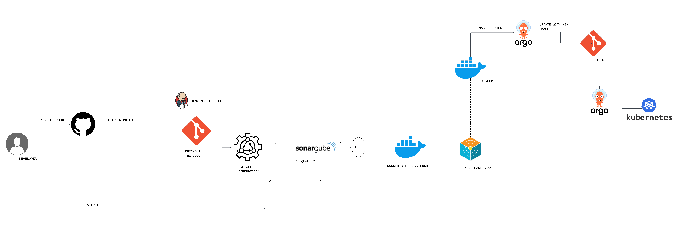

# 📚 Book Library App

A simple and robust **Book Library** application built with **Node.js**, allowing users to **add**, **delete**, and **edit** books.

## 🚀 Features

- 📘 Add new books
- ✏️ Edit existing books
- ❌ Delete books
- 🌐 RESTful API built with Node.js
- 🧪 Automated testing & code quality checks
- 🐳 Containerized with Docker
- ☁️ Deployed on Kubernetes using ArgoCD

---

## 🛠 Tech Stack

| Category          | Technology         |
|-------------------|--------------------|
| Language          | Node.js            |
| Database          | MongoDB            |
| CI/CD             | Jenkins, ArgoCD    |
| Containerization  | Docker             |
| Quality Analysis  | SonarQube          |
| Security Scanning | Trivy              |
| Deployment        | Kubernetes         |
| Version Control   | Git + GitHub       |

---

## ⚙️ CI/CD Pipeline Overview

1. Developer pushes code to GitHub.
2. Jenkins pipeline is triggered:
   - Checks out code
   - Installs dependencies
   - Runs SonarQube for code quality
   - Runs tests
   - Builds Docker image
   - Scans image with Trivy
   - Pushes image to DockerHub
3. ArgoCD updates the Kubernetes deployment automatically with the new image.

---

## 📸 Architecture Diagram

---

## 🧪 SonarQube & Security

- Code is scanned using **SonarQube** for bugs and vulnerabilities.
- Docker images are scanned with **Trivy** to ensure container security.

---

## 🚚 Deployment

The application is deployed on a **Kubernetes** cluster using **ArgoCD** with GitOps principles. The manifest repo is automatically updated and synced.

